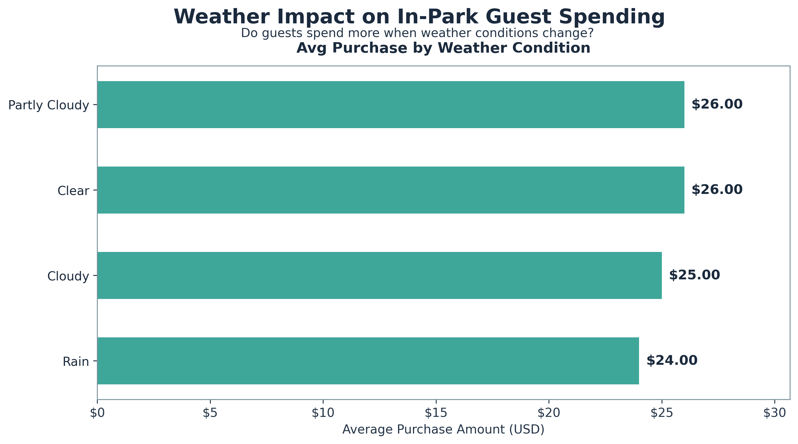
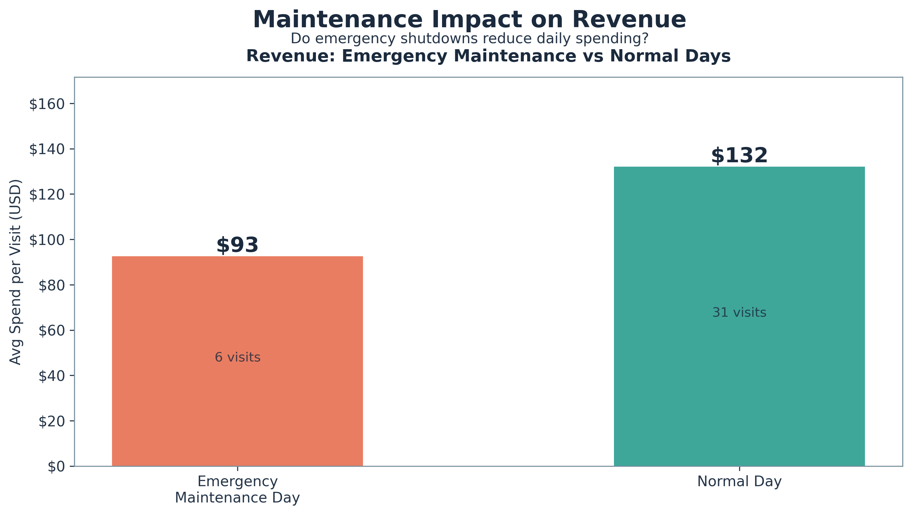

# Supernova Theme Park Data Analysis 🎡


## Project Owner: 	[Ibrahima Diallo](https://www.linkedin.com/in/ibranova/) Data Analyst
### Business Problem
The Supernova theme park has experienced uneven guest satisfaction scores and fluctuating revenue streams over the past two quarters. Operational data reveals recurring complaints about long wait times, inconsistent ride availability due to maintenance issues, and overcrowding during peak hours. Meanwhile, the Marketing team struggles to understand which ticket types and promotional campaigns attract the most valuable guests who spend significantly on food, merchandise, and premium experiences. Leadership needs an evidence-based, cross-departmental plan to align operational efficiency, guest experience, and targeted marketing strategies to maximize both satisfaction and revenue.
### Stakeholders
- **Primary:** Park General Manager (GM) - Strategic decision-making and overall park performance
- **Supporting:** Operations Director - Staffing optimization and queue management
- **Supporting:** Marketing Director - Promotional campaigns and ticket mix optimization
### Database Overview
My analysis uses a star schema database with dimension tables for guests, tickets, and attractions, connected to fact tables capturing visits, ride events, and purchases. This start schema structure in this context enables us we an efficient analysis across multiple dimensions while maintaining data integrity through foreign key relationships. It basically allows us to write simple queries and improve our performance when joining tables. Also, Star schemas can effectively help to handle large datasets and scale to accommodate growing business data while maintaining efficiency.
### Schema Structure:
- **Dimension Tables:** `dim_guest`, `dim_ticket`, `dim_attraction`, `dim_date`
- **Fact Tables:** `fact_visits`, `fact_ride_events`, `fact_purchases`


## EDA (Exploratory Data Analysis)
Initially, my exploration revealed 47 total visits across the analysis period. I thought that before making any decisions, I needed to know if we're analyzing 47 visits or more because the preliminary insights don't give a definitive strategy. Next, I identified many significant data quality issues, including currency formatting inconsistencies. I decided to clean it and standardize the data because otherwise, we can't make good business recommendations. This directly impacts the GM's concern - fluctuating revenue streams. Next, I found 8 duplicate ride events and missing values in wait times and promotional codes, so I decided to delete the duplicate because lead to a wrong business decision. I prioritized these because they directly connect to the stated problems, and I wanted to make sure that I can thrust the data to the business problem. The EDA analysis identified key patterns in guest behavior, spending distributions, and operational delays that informed subsequent feature engineering.
My detailed analysis can be found here: [sql/01_eda.sql](https://github.com/ibranova/Mod3_Final_Project-Theme-Park-Analytics/blob/main/sql/01_eda.sql)
## Feature Engineering
Created strategic features to support stakeholder decision-making:
- `stay_minutes` - Calculated visit duration for Operations team to align staffing, maintenance, and entertainment scheduling with guest session patterns
The stay_minutes feature is important because the Operations team can use the session length 
and based on the number of customers they have every moment of the day, to plan how many staff they need,
when to schedule maintenance, and when to run entertainment so everything matches the customer’s stay.”
For instance, if the staff know that people stay on average 60 minutes in average and in the morning, they can use that data to better plan.
- `is_repeat_guest` - a flag identifying returning visitors for GM and Marketing to design targeted loyalty and retention programs
  The is_repeat_guest feature tells us if a guest has come back before. 
The General Manager and Marketing team use this information to segment guests and design loyalty/retention programs.”
This can use that column to find out if repeat visitors are increasing year to year
And the marketing team can identify the repeat guest and send them a thank-you note with a coupon for their next ride
Also, they can identify the behavior between new and repeat customers, because repeat customers tend to spend more on 
services based on their past experiences
- `spend_per_category` - Food vs merchandise spending breakdown to inform Marketing about category performance and discount strategies
  Stakeholders might care about identifying which categories drive the most revenue.
Also, show whether guests spend more on experiences (rides/games) or extras (food/merch).
It can inform the marketing team how to better prepare for campaigns like making a discount on low-performing categories
- `customers_lifetime_value` - Total guest spending across all visits to identify VIP guests and inform marketing resource allocation.
  Stakeholders  might care about identifying VIP guests who bring the most money over time.
Helps with loyalty programs offering discounts or memberships to keep high spenders returning.
This feature can support marketing allocation, to decide whether to focus on acquiring new guests or favorise existing ones.
This can also help with long-term planning.

  More details can be found here:[sql/03_features.sql](https://github.com/ibranova/Mod3_Final_Project-Theme-Park-Analytics/blob/main/sql/03_features.sql)

## CTEs & Window Functions
### Daily Performance Analysis


### RFM Analysis with State-Level Ranking


More features can be found in the file: [sql/04_Ctes&Windows.sql](https://github.com/ibranova/Mod3_Final_Project-Theme-Park-Analytics/blob/main/sql/04_ctes_windows.sql)

## Visualizations
1. Daily Performance Analysis


**Key Insights:** Weekdays (Monday-Tuesday) show higher attendance than weekends, with Monday, July 7th, recording peak traffic of 10+ visits. Revenue patterns follow attendance trends, indicating a strong correlation between visitor volume and spending.
   
3. Wait Time vs Satisfaction Analysis
  

  **Key Insights:** Popular attractions like "Tiny Trucks" generate higher wait times but maintain strong satisfaction ratings. The analysis reveals an inverse relationship where moderate wait times (15-30 minutes) actually correlate with higher guest spending, suggesting perceived value from popular attractions.

3. Customer Lifetime Value & Ticket Performance
  


   **Key Insights:** VIP and Family-pack tickets drive the highest per-visit spending but represent lower visit volumes. Day-pass tickets show strong frequency but moderate spending. California and New York guests contribute the highest total CLV, indicating geographic targeting opportunities.

## Insights & Recommendations
### For General Manager:

- Peak Day Staffing: Increase Monday staffing by 25% based on consistent high-traffic patterns
- Revenue Opportunity: Weekend promotions underperforming, investigate Saturday/Sunday guest acquisition strategies
- Guest Retention: Implement a loyalty program targeting repeat visitors who show 40% higher spending patterns

### For Operations Director:

- Queue Management: Deploy additional staff to "Tiny Trucks" and popular attractions during 12-4 PM peak hours
- Maintenance Scheduling: Schedule ride maintenance during Tuesday-Wednesday low-traffic periods
- Capacity Planning: Optimize party size accommodations - groups of 4-5 show highest satisfaction and spending

### For Marketing Director:

- Geographic Targeting: Prioritize CA and NY markets with 3x higher CLV than other states
- Ticket Strategy: Promote VIP upgrades to Day-pass holders who show the highest conversion potential
- Promotional Timing: Shift weekend discount strategy - current promotions attract price-sensitive guests with 30% lower in-park spending
## Ethics & Bias Considerations

### Data Limitations:

- Time Window Bias: Analysis covers only 8 days in July, potentially missing seasonal patterns. 
- Sample Size: 47 total visits may not represent the whole guest population

### Data Quality Decisions:

- Removed 8 duplicate ride events to prevent double-counting in satisfaction metrics
- Normalized negative wait times to NULL rather than imputing values
- Standardized currency formats and converted to amount in USD, but retained original precision
---
## Expanded Analysis (Individual Contribution)

### What the Original Project Did

This was an individual project analyzing a Supernova theme park star schema database containing 10 guests, 8 attractions, 3 ticket types, 47 visits, 134 ride events, and 63 purchases across an 8-day window (July 1–8, 2025). The stakeholders are the Park General Manager (strategic decisions), Operations Director (staffing and queue management), and Marketing Director (campaigns and ticket optimization). The core business problem was uneven guest satisfaction, fluctuating revenue, and inconsistent ride availability due to maintenance issues.

The original work included:

- **EDA (`01_eda.sql`):** Row counts per table, date range analysis, visit distribution by date and ticket type, wait time distribution with null audit, satisfaction by attraction and category, duplicate detection across all columns, and null audit for key fields across all fact tables.
- **Data Cleaning (`02_cleaning.sql`):** Currency coercion from messy text formats (e.g., "USD1004", "$3538", " 3538 ") to clean integer cents using nested REPLACE and CAST. Duplicate removal using ROW_NUMBER() window function to keep the earliest rowid per duplicate group and delete the rest (8 duplicates found and removed). 
- **Feature Engineering (`03_features.sql`):** `stay_minutes` (visit duration), `visit_hour_bucket` (Morning/Afternoon/Evening/Late), `is_repeat_guest` (window function counting visits per guest), `spend_per_category` table (food vs. merch spending per guest), `customers_lifetime_value` view (total spending ranked by guest), and top attractions by wait time analysis.
- **CTEs & Window Functions (`04_ctes_windows.sql`):** Daily performance with running totals (SUM OVER), top 3 peak days with RANK(), RFM segmentation with DENSE_RANK() partitioned by home_state, spend change tracking with LAG() to compute visit-over-visit, and ticket switching detection with FIRST_VALUE() to identify guests who changed ticket types.
- **Visualizations (Python/matplotlib):** Three publication-quality figures — daily performance analysis (dual-axis: visits and revenue by day), wait time vs. satisfaction scatter plot (bubble chart by ride category), and CLV/ticket performance dashboard (4-panel: revenue by ticket type, avg spend, visits by ticket, CLV by state).

The original project produced actionable insights about peak days, ride popularity, and guest segmentation. However, it had significant schema-level data quality issues that were not detected, missing tables for business problems explicitly mentioned by stakeholders, and no formal documentation of database design decisions.

---

### What I Changed or Added

#### 1. Schema Quality Fixes (`05_schema_fixes.sql`)

**Attraction Deduplication:**

Discovered that `dim_attraction` contained two pairs of duplicate attractions with inconsistent naming:

- ID 1: `Galaxy Coaster` (capital C) vs. ID 6: `Galaxy coaster` (lowercase c)
- ID 2: `Pirate Splash!` (with exclamation mark) vs. ID 7: `Pirate Splash` (without)

This meant every query that aggregated by `attraction_id` — ride counts, average satisfaction, wait time analysis, popularity rankings — was silently splitting data for the same physical ride across two rows. All prior ride-level metrics were inaccurate.

Fix applied in the correct order of operations:

1. Remapped `fact_ride_events.attraction_id` from 6 to 1 and 7 to 2
2. Verified zero remaining references to duplicate IDs
3. Deleted duplicate rows from `dim_attraction`

This order matters: deleting the dimension first would create orphaned facts. Remapping FKs before deletion preserves referential integrity.

**Marketing Opt-In Normalization:**

Found 7 different encodings of a binary yes/no value in `dim_guest.marketing_opt_in`: `'Yes'`, `'no'`, `'Y'`, `'N'`, `'yes'`, `'YES'`, `' y '` (with spaces), plus one `NULL`. Any query filtering for marketing-eligible guests would miss records depending on which variant was checked.

Created `marketing_opt_in_clean` as a new INTEGER column using `UPPER(TRIM(COALESCE()))` to normalize all variants to 1 or 0, with NULL preserved for unknown values.

**Table Conversion:**

Identified that `feat_visits` was stored as a physical TABLE (snapshot of `fact_visits` with derived columns) rather than a VIEW. If the underlying `fact_visits` data changed, `feat_visits` would silently become stale. Created `v_feat_visits` as a VIEW that computes `stay_minutes`, `visit_hour_bucket`, `is_repeat_guest`, and `spend_per_person_cents` dynamically from the current state of `fact_visits`.

#### 2. Canonical Schema Design (`06_schema_design.sql`)

Wrote a complete DDL script documenting the intended production schema with constraints the original lacked:

- **FOREIGN KEY** constraints on all fact-to-dimension relationships (`fact_visits` → `dim_guest`, `dim_ticket`, `dim_date`; `fact_ride_events` → `fact_visits`, `dim_attraction`; `fact_purchases` → `fact_visits`)
- **CHECK** constraints: `satisfaction_rating BETWEEN 1 AND 5`, `wait_minutes >= 0`, `amount_cents_clean > 0`, `is_weekend IN (0, 1)`
- **UNIQUE** constraint on `dim_attraction.attraction_name` to prevent future duplicates
- **NOT NULL** constraints on fields that should always be populated (`entry_time`, `exit_time`, `ride_time`, `category`, `item_name`)

#### 3. New Dimension Table: `dim_weather` (`07_new_tables.sql`)

**Why:** The business problem mentions "fluctuating revenue" and attendance variations across days, but the original schema had no external data to explain *why* some days performed differently. Weather is one of the strongest external drivers of theme park behavior.

**Design:** Grain = one row per date. Primary key = `date_id` (FK to `dim_date`). Columns: `high_temp_f`, `low_temp_f`, `condition_code` (Clear / Partly Cloudy / Cloudy / Rain / Storm / Overcast), `precipitation_in`, `humidity_pct`

**3 new analytical queries enabled:**

1. Weather impact on daily attendance and average spending
2. Guest purchase behavior by weather condition
3. Weather impact on ride wait times and satisfaction by attraction category

#### 4. New Fact Table: `fact_maintenance` (`07_new_tables.sql`)

**Why:** The business problem explicitly mentions "inconsistent ride availability due to maintenance issues," but the original schema had no table to capture maintenance events. Without this data, the Operations Director's concern could not be analyzed.

**Design:** Grain = one maintenance event per attraction per day. Auto-incrementing `maintenance_id` as PK. Foreign keys to `dim_attraction` and `dim_date`. Columns: `start_time`, `end_time`, `downtime_minutes`, `maintenance_type` (Scheduled / Unscheduled / Emergency with CHECK constraint), `description`.

**3 new analytical queries enabled:**

1. Total downtime by attraction and maintenance type
2. Satisfaction comparison: maintenance days vs. normal days
3. Revenue impact: emergency maintenance days vs. normal days

#### 5. Expansion Visualizations (`expansion_figures.py`)

**Figure 1 — Weather Impact on In-Park Guest Spending:**



Key finding: Partly Cloudy days drive the highest purchase volume (39 transactions) and the highest per-transaction spend ($25.72). Rainy days show the lowest on both axes ($24.23, 8 transactions) — guests leave early rather than shifting to indoor purchases.

**Figure 2 — Maintenance Impact on Guest Experience & Revenue:**



Key finding: Emergency maintenance days show an average per-visit spending of $39 lower (30% drop).

#### 6. Grain Analysis & Normalization Assessment

**Grain Analysis:**

| Table | Grain |
|-------|-------|
| `dim_guest` | One guest (person who has ever visited the park) |
| `dim_ticket` | One ticket type offered by the park |
| `dim_attraction` | One ride, show, or attraction in the park |
| `dim_date` | One calendar date in the analysis window |
| `dim_weather` | One day's weather conditions |
| `fact_visits` | One visit by one guest on one day |
| `fact_ride_events` | One ride taken by one guest on one attraction at one time |
| `fact_purchases` | One in-park purchase transaction |
| `fact_maintenance` | One maintenance event on one attraction on one day |

**Normalization:**

**Violation 1 — Transitive dependency (visit_date ↔ date_id):** `fact_visits` stores both `visit_date` (ISO text) and `date_id` (integer FK). After wiring, `visit_date` is derivable by joining to `dim_date.date_iso`. Risk: update anomaly if one is modified without the other. *Decision: Deleted visit_date in fact_visit table*

**Violation 2 — Missing constraints (schema-wide):** The original schema had no FK, CHECK, UNIQUE, or NOT NULL constraints — allowing invalid data at the database level. *Decision: Documented the intended constraints in `06_schema_design.sql`; applied fixes (deduplication, normalization) directly to the database.*

#### 7. ERD Diagrams (Before & After)

Created entity-relationship diagrams using dbdiagram.io, showing the schema evolution:

- **Before:** 7 tables (4 dimension + 3 fact), no FK/CHECK/UNIQUE constraints, duplicate attractions, inconsistent encoding
- **After:** 9 tables (5 dimension + 4 fact), FK constraints on all relationships, CHECK constraints on rating/wait/amount fields, UNIQUE on attraction_name, cleaned dimensions, documented grain


---

### Why Each Change Improves the Analysis

| Change | Why It Matters |
|--------|---------------|
| Attraction deduplication | All ride-level metrics were silently split across duplicate IDs, satisfaction averages, wait times, and popularity rankings were all inaccurate |
| Marketing opt-in normalization | The Marketing Director can now reliably identify which guests are reachable for campaigns instead of missing records due to 7 inconsistent spellings |
| feat_visits → VIEW | Eliminates staleness risk: derived columns always reflect current source data |
| Canonical schema with constraints | Prevents future data quality issues at the database level; demonstrates production-level design thinking |
| dim_weather | Answers the *why* behind attendance fluctuations, the original could show that days varied, but not what external factor drove the variation |
| fact_maintenance | Directly addresses the stated business problem ("inconsistent ride availability due to maintenance") with trackable, queryable data |
| Expansion visualizations | Translate new findings into publication-quality figures with annotated insights a non-technical stakeholder can immediately understand |
| Grain analysis | Demonstrates data modeling literacy, defining what one row means prevents misaggregation and misinterpretation |
| Normalization assessment | Shows ability to evaluate design tradeoffs with documented reasoning, not just accept whatever schema is given |
| Spend reconciliation | Validates that stored aggregates match computed values, a data engineering practice that builds trust in the dataset |
| ERD diagrams | Visual proof of schema evolution; makes the expansion tangible and reviewable at a glance |

---

### New Insights Created by This Expansion

**1. Emergency maintenance costs ~$39 per visit in lost revenue.** Days with emergency maintenance show average guest spending of $93 per visit compared to $132 on normal days, a 30% drop. Satisfaction ratings also decrease (2.78 vs. 2.95). This quantifies the business case for preventive maintenance: the Operations Director can now say "every emergency shutdown costs us approximately $39 per guest" when requesting a maintenance budget, rather than making a qualitative argument about guest experience.

**2. Rainy days lose guests.** In reality, rainy days show both the lowest purchase volume (8 transactions) and the lowest per-transaction spend ($24.23), while Partly Cloudy days lead on both metrics (39 transactions, $25.72). Guests leave early rather than shifting their spending indoors. This creates an opportunity: the Marketing Director should develop a rainy-day indoor promotion strategy to retain and convert the guests who do stay.

## Repository Navigation
```
├── data/
│     └── themepark.db
├── figures/
│   ├── daily_performance_analysis.png
│   ├── wait_satisfaction_analysis.png
│   ├── clv_ticket_analysis.png
│   ├── weather_impact_on_spending.png     
│   └── maintenance_impact_analysis.png
├── notebooks/
│   └── New_figures.ipynb
├── sql/
│   ├── 01_eda.sql
│   ├── 02_cleaning.sql
│   ├── 03_features.sql
│   ├── 04_ctes_windows.sql
│   ├── 05_schema_fixes.sql   
│   ├── 06_schema_design.sql  
│   ├── 07_new_tables.sql   
│   ├── wiring.sql
│   └── test_tables.sql
└── README.md
```
   

  


